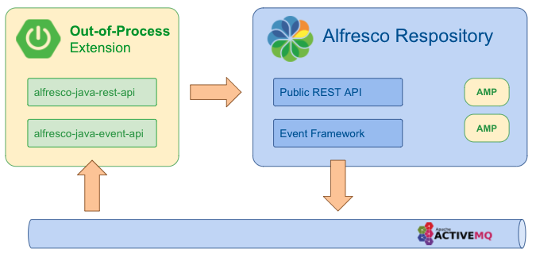

# Welcome to the Alfresco Out-of-Process Java SDK

<p align="center">
  </img>
</p>

## What is Alfresco Java SDK?
The Alfresco Java SDK includes a set of APIs and samples that allows developers to quickly build out-of-process Java applications that integrate with Alfresco. <br/>

This SDK provides functionality to connect to both on-premise and Cloud-based servers. Alfresco servers of version 7.x and above are supported. 

## What is Out-of-Process?

[Alfresco SDK 4.x](https://github.com/Alfresco/alfresco-sdk) was conceived for creating JAR and AMP modules that run in the same JVM as Alfresco Repository or Share. This is still the default extension approach for certain use cases (e.g. Content modelling).
                                                             
Alfresco Java SDK 5.0.0 is not a continuation of 4.x. Instead, it is an additional SDK that allows developers to create out-of-process extensions. These applications run separately, consuming public APIs exposed by Alfresco Repository.

<p align="center">
  </img>
</p>

Existing projects with business logic that could be lifted out and implemented as an external service can use Alfresco Java SDK 5.0 and start using the public REST API to interact with the Repository. Any business logic executed as a result of an action in the Repository, such as document or folder uploaded, updated, deleted, can be reimplemented as an external out-process extension utilizing the new Event API.

## How does it work?

Alfresco Java SDK consist of the following groups of libraries:
* [alfresco-java-rest-api](alfresco-java-event-api): Allows applications to consume Alfresco public REST APIs.
* [alfresco-java-event-api](alfresco-java-event-api): Allows applications to react to events produced by Alfresco Repository.

The [samples](samples) folder includes examples, sample applications and code snippets of the different features supported by the SDK. Each sample application contains a `docker-compose` file and scripts that allows you to build and run the extension.  


### Pre-Requisites

* Java version 11 or higher
* Maven version 3.3 or higher

### Quick start

#### 1. Create a new Spring Boot application

#### 2. Add these dependencies to your project's build file:

Maven:

First, add to the repositories the Alfresco public repository containing the artifacts:
```xml
  <repositories>
  
    <repository>
      <id>alfresco-public</id>
      <url>https://artifacts.alfresco.com/nexus/content/groups/public</url>
    </repository>
  
  </repositories>
```
Then, add the dependency on the desired starter(s)
```xml
  <dependencies>

    <!-- Java REST API -->
    <dependency>
      <groupId>org.alfresco</groupId>
      <artifactId>alfresco-java-rest-api-spring-boot-starter</artifactId>
      <version>5.0.0</version>
    </dependency>

    <!-- Java Event API -->
    <dependency>
      <groupId>org.alfresco</groupId>
      <artifactId>alfresco-java-event-api-spring-boot-starter</artifactId>
      <version>5.0.0</version>
    </dependency>
  </dependencies>
```

Gradle:

First, add to the repositories the Alfresco public repository containing the artifacts:
```groovy
repositories {
    maven {
        url "https://artifacts.alfresco.com/nexus/content/groups/public"
    }
}
```
Then, add the dependency on the desired starter(s)
```groovy
compile "org.alfresco:alfresco-java-rest-api-spring-boot-starter:5.0.0"
compile "org.alfresco:alfresco-java-event-api-spring-boot-starter:5.0.0"
```


#### 3. Configure Event API 

In your ```application.properties``` file define the properties required to connect to the ActiveMQ broker in order to handle Repository events:

```
spring.activemq.brokerUrl=tcp://activemq-host:61616
```
Alternatively, set `SPRING_ACTIVEMQ_BROKER_URL` environment variable. 

For additional configuration properties of Event API, check [alfresco-java-event-api](alfresco-java-event-api).

#### 4. Configure REST API 

In your ```application.properties``` file provide URL, authentication mechanism and credentials for accessing the REST API:

```
content.service.url=http://repository:8080
content.service.security.basicAuth.username=admin
content.service.security.basicAuth.password=admin
```

Alternatively, if you are using OAuth2, you can use client-credential based authentication:

```
security.oauth2.client.grantType=client_credentials
security.oauth2.client.clientId=clientId
security.oauth2.client.clientSecret=clientSecret
security.oauth2.client.accessTokenUri=${keycloak.auth-server-url}/realms/${keycloak.realm}/protocol/openid-connect/token
```

#### 5. Handle events produced by the Repository

Use out-of-the-box Event Handlers to handle specific events, using Event Filters to react to the event, only if it meets certain conditions.

```java
/**
 * Sample event handler to demonstrate reacting to the update of a content in the repository.
 */
@Component
public class ContentUpdatedHandler implements OnNodeUpdatedEventHandler {

    private static final Logger LOGGER = LoggerFactory.getLogger(ContentUpdatedHandler.class);

    @Override
    public void handleEvent(final RepoEvent<DataAttributes<Resource>> repoEvent) {
        LOGGER.info("The content of the node {} has been updated!", ((NodeResource) repoEvent.getData().getResource()).getName());
    }

    @Override
    public EventFilter getEventFilter() {
        return ContentChangedFilter.get();
    }
}
```

Use `@Order` annotation to define an execution order of multiple event handlers.

```java
    /**
     * This event handler definition illustrates how you can use Spring's {@link Order} annotation to sort the execution of event handlers.
     */
    @Bean
    @Order(10)
    public OnNodeCreatedEventHandler firstCustomNodeCreatedEventHandler() {
        return repoEvent -> LOGGER.info("First Event handler triggered on node created - Event: {}", repoEvent);
    }

    /**
     * This event handler definition illustrates how you can use Spring's {@link Order} annotation to sort the execution of event handlers.
     */
    @Bean
    @Order(20)
    public OnNodeCreatedEventHandler secondCustomNodeCreatedEventHandler() {
        return repoEvent -> LOGGER.info("Second Event handler triggered on node created - Event: {}", repoEvent);
    }
```

Alternatively, use Spring Integration to consume events:

```java
    @Bean
    public IntegrationFlow logTheCreationOfHTMLContent() {
        return IntegrationFlows.from(EventChannels.MAIN)
                .filter(IntegrationEventFilter.of(EventTypeFilter.NODE_CREATED
                                                    .and(MimeTypeFilter.of("text/html"))))
                .handle(t -> LOGGER.info("An HTML content has been created! - Event: {}", t.getPayload().toString()))
                .get();
    }
```

You can find more information about how to consume events at [alfresco-java-event-api](alfresco-java-event-api).

#### 6. Consume the REST API

```java
    CommentsApi commentsApi;

    public void addComentToNode(final String nodeId) {
        CommentBody commentBody = new CommentBody().content("I like this file");
        commentsApi.createComment(nodeId, commentBody);
    }
}
```

You can find more information about how to consume the REST API at [alfresco-java-rest-api](alfresco-java-rest-api).
