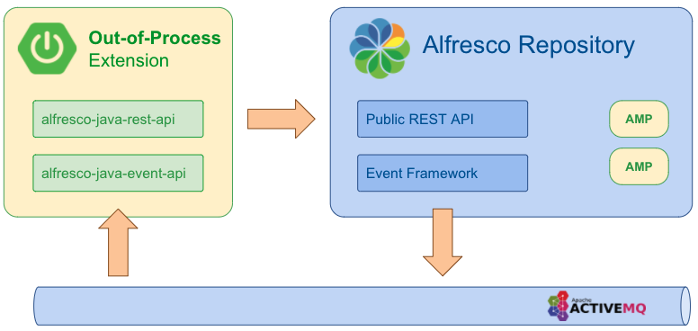

# Welcome to the Alfresco Out-of-Process Java SDK

  </img>

## What Is Alfresco Java SDK?
The Alfresco Java SDK includes a set of APIs and samples that allows developers to quickly build out-of-process Java applications that integrate with Alfresco.  

This SDK provides functionality to connect to both on-premise and Cloud-based servers. Alfresco servers of version 7.x and above are supported. 

## What Is Out-of-Process?

[Alfresco SDK 4.x](https://github.com/Alfresco/alfresco-sdk) was conceived for creating JAR and AMP modules that run in the same JVM as Alfresco Repository or Share. This is still the default extension approach for certain use cases (e.g. Content modelling).
                                                             
Alfresco Java SDK 5.0 is not a continuation of 4.x. Instead, it is an additional SDK that allows developers to create out-of-process extensions. These applications run separately, consuming public APIs exposed by Alfresco repository.

  </img>

Existing projects with business logic that could be lifted out and implemented as an external service can use SDK 5.0 and start using the public REST API to interact with the Repository. Any business logic executed as a result of an action in the Repository, such as document or folder uploaded, updated, deleted, can be reimplemented as an external out-process extension utilizing the new event syste 

